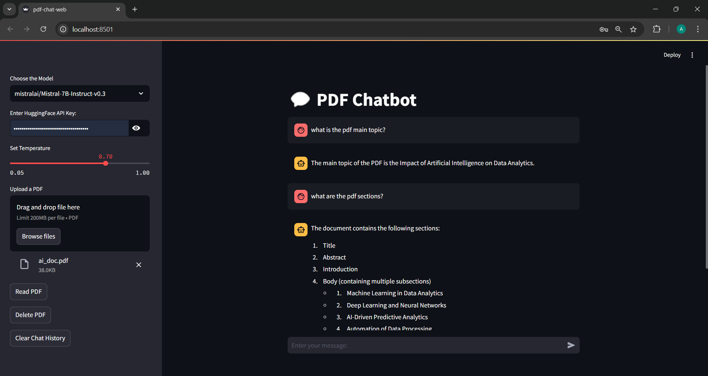
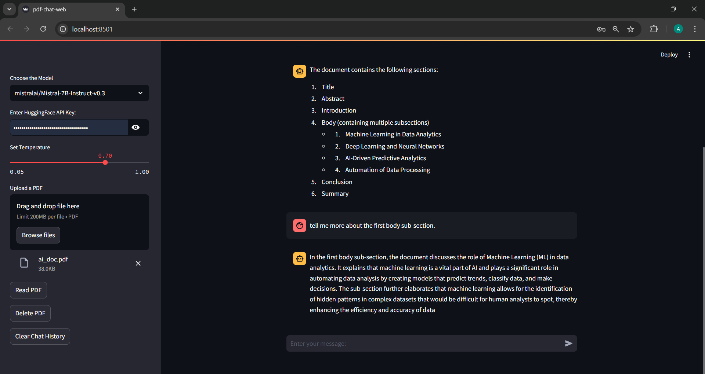

# Interactive PDF Chatbot with AI-Powered Document Retrieval  

An intelligent chatbot application designed to interact with PDF documents and provide precise, context-aware answers using Retrieval-Augmented Generation (RAG). Built with advanced NLP techniques, FAISS vector search, and a user-friendly Streamlit interface.  

---

## **Features**  
- PDF processing and text extraction.  
- RAG workflow with custom prompt engineering.  
- Efficient document retrieval using FAISS.  
- Interactive Streamlit interface for real-time conversations.  

---

## **Tech Stack**  
- Python  
- Streamlit  
- Hugging Face  
- FAISS  
- PyPDF2  
- LangChain  

---

## **Usage**  
1. Clone the repository.  
2. Upload a PDF via the Streamlit app.  
3. Configure the model, temperature, and Huggingface API key.  
4. Interact with the chatbot for document-based queries.

---

## **Example**

  

  

--- 

## **Repository Structure**  

```bash
├── ai_doc.pdf
├── pdf-chat.ipynb 
├── app.py
├── README.md 
├── image1.png 
└── image2.png
```